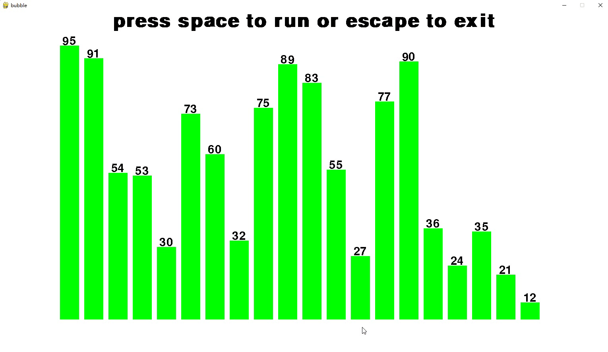
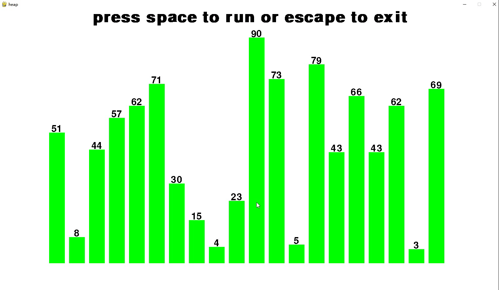
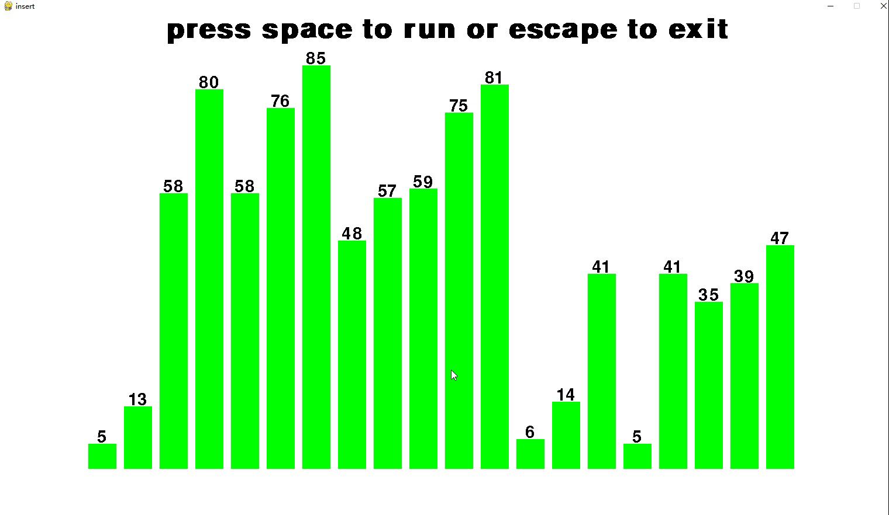
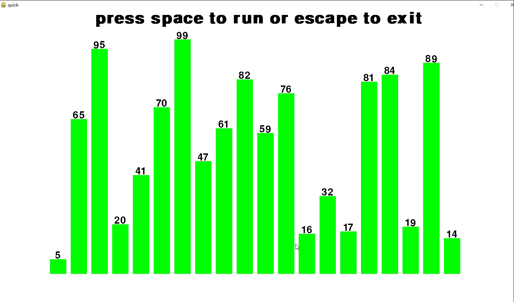
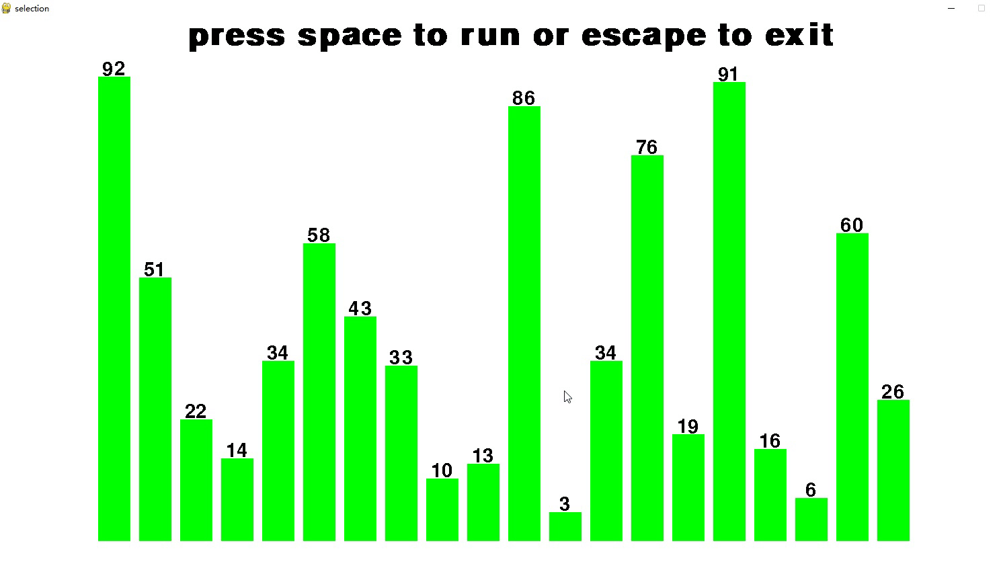
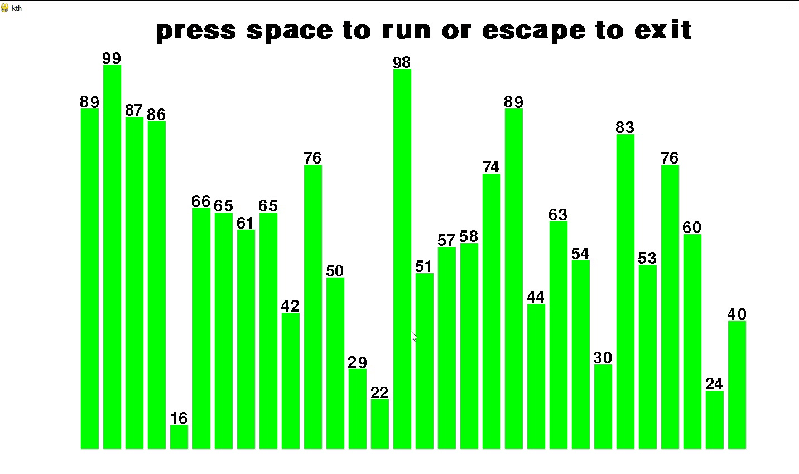
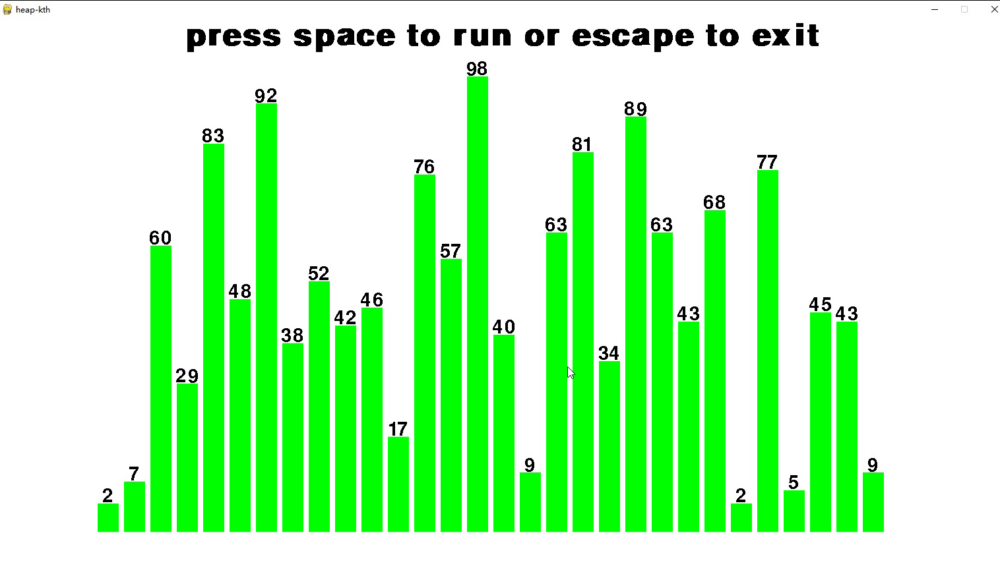

# sort
use pygame to show different kinds of common sorting.
in this project, you can see the progress of bubble-sort,insert-sort,quick-sort,shell-sort,heap-sort,choice-sort ,as all of them are
sorting in-placement;
you can also compare the 6 kinds of sort in a same panel;
you can also see how to get the nth large in a given list by quick and heap sort;


### bubble

```shell
python ./bubble.py
#if __name__ == '__main__':
#    showSort(None,BubbleSortThread,'bubble')
```

in the above code, showSort is a common function for all 7 different sort alg, and the first  parameter is an array with integer elements you want to sort; if you set it None, the function will generate an array with 20 (default, you can change) random integer. 

```python
# common.py
class ArraySet:
    def __init__(self,numarray = None):
        if numarray is None or len(numarray) == 0:
            self.numList = getNumList(count=defaultArrayLen)
        else:
            self.numList = numarray
# local.py
defaultArrayLen = 20
```



### heap

```shell
python ./heap.py
#if __name__ == '__main__':
#    showSort(None,HeapThread,'heap')
```




### insert

```shell
python ./insert.py
#if __name__ == '__main__':
#    showSort(None,InsertSortThread,'insert')
```



### quick

```shell
python ./quick.py
#if __name__ == '__main__':
#    showSort(None,QuickThread,'quick')
```



### selection

```shell
python ./selection.py
#if __name__ == '__main__':
#    showSort(None,SelectionThread,'selection')
```



### merge

merge is different, it's hard to visual the sort progress, so here it cannot work as others. 


### compare 

```shell
python compare.py
#if __name__ == '__main__':
# 	 ....
#    array = getNumList(count = 25) # here you can change the array to yours.
```

in this code,  i will show sort an array with 6 different alg simultaneously,  and you will see the speed more clearly.


### ### how to find k-th num in order

you are given an integer array,  how to find the k-th in order num?  you can sort all the array, then get the k-th num, but it's too slow, while quick and heap are better solution:

#### quick-kth

```shell
python quick_kth.py
#if __name__ == '__main__':
#    count = 30 # how long the array
#    numList = getNumList(count = count)
#    import copy
#    b = copy.deepcopy(numList)
#    b.sort(reverse=True)
#    import random
#    kth = random.randint(0,count) # k-th index, you can set by yourself.
```



### heap-kth

```shell
python heap_kth.py
#if __name__ == '__main__':
#    count = 30 # how long the array
#    array = getNumList(count = count)
#    import copy,random
#    b = copy.deepcopy(array)
#    b.sort(reverse=True)
#    kth = random.randint(0,count) # k-th index, you can set by yourself.
```


